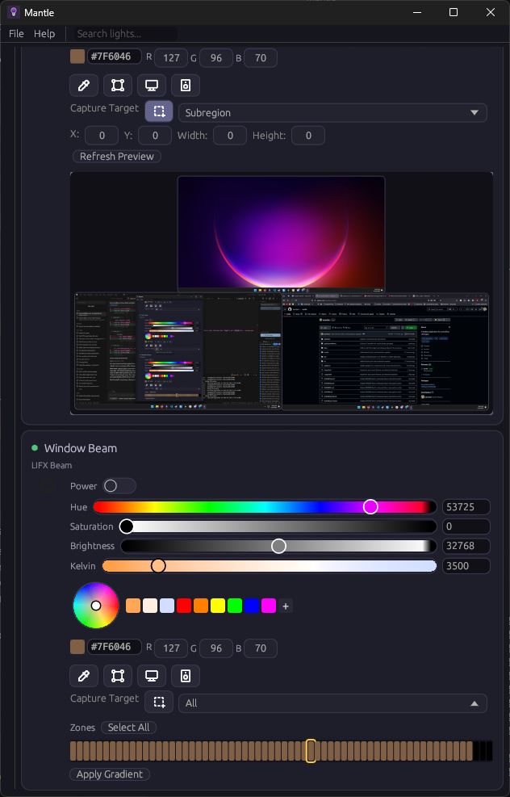

# Mantle


🌐 [English](README.md) | [Español](README.es.md) | [简体中文](README.zh-CN.md) | [Français](README.fr.md) | [Deutsch](README.de.md) | [Português](README.pt-BR.md)

Mantle es una aplicación de escritorio multiplataforma diseñada para descubrir y controlar luces inteligentes [LIFX](https://www.lifx.com/) a través de su red local. Desarrollada con Rust y [egui](https://github.com/emilk/egui), ofrece gestión de la iluminación en tiempo real junto con características ambientales únicas, tales como la sincronización con los colores de la pantalla, iluminación reactiva al audio, escenas guardadas con programación, atajos de teclado globales y un icono en la bandeja del sistema para un acceso rápido. Nació de las cenizas de [`lifx_control_panel`](https://github.com/samclane/LIFX-Control-Panel).

## Lanzamientos

Puede descargar la última versión [aquí](https://github.com/samclane/mantle/releases).

Hay compilaciones disponibles para **Windows** (x86_64), **Linux** (x86_64) y **macOS** (Apple Silicon / aarch64). ## Capturas de pantalla



## Características

### Detección y control de luces

- Detecta automáticamente las bombillas LIFX en la red local
- Enciende/apaga y ajusta el tono, la saturación, el brillo y la temperatura de color (Kelvin) mediante controles deslizantes en tiempo real
- Configura la duración de las transiciones para lograr cambios de color fluidos
- Soporte multizona para tiras de luz, con controles individuales por zona y opciones de degradado

### Agrupación

- Organiza las luces en grupos
- Controla todas las luces simultáneamente o filtra/busca por nombre

### Cuentagotas y sincronización de pantalla

- Selecciona cualquier color de tu pantalla con la herramienta de cuentagotas
- Calcula el color promedio de una región de la pantalla, una ventana o el monitor completo para controlar la iluminación ambiental en tiempo real

### Iluminación reactiva al audio

- Controla los colores de las luces a partir de la entrada del micrófono mediante análisis FFT
- Ventana opcional de depuración de formas de onda para visualizar el espectro de audio

### Escenas y programación

- Guarda y carga escenas personalizadas (ajustes preestablecidos de color para múltiples luces)
- Programa las escenas para que se activen automáticamente a horas específicas del día

### Atajos de teclado

- Asigna atajos de teclado globales a acciones de iluminación para un control manos libres

### Área de notificación (System Tray)

- Minimiza la aplicación al área de notificación del sistema
- Enciende/apaga rápidamente las luces y cierra la aplicación desde el menú del área de notificación

### Localización

- Disponible en 6 idiomas: inglés, español, chino simplificado, francés, alemán y portugués (Brasil)

## Desarrollado con

| Crate | Propósito |
|-------|---------|
| [eframe](https://github.com/emilk/egui/tree/master/crates/eframe) / [egui](https://github.com/emilk/egui) | Framework para interfaz gráfica (GUI) |
| [lifx-core](https://github.com/eminence/lifx) | Protocolo LAN de LIFX |
| [cpal](https://github.com/RustAudio/cpal) + [rustfft](https://github.com/ejmahler/RustFFT) | Captura de audio y FFT |
| [xcap](https://github.com/niceChenGitH/xcap) | Captura de pantalla |
| [rdev](https://github.com/Narsil/rdev) | Entrada global de teclado y ratón |
| [tray-icon](https://github.com/niceChenGitH/tray-icon) | Área de notificación |
| [rust-i18n](https://github.com/longbridge/rust-i18n) | Localización |

## Compilación

### Prerrequisitos

- Cadena de herramientas de [Rust](https://www.rust-lang.org/tools/install) (estable)
- La carpeta `data/` que contiene `products.json` (incluida en el repositorio; se incrusta en tiempo de compilación)

**Solo para Linux** — instale las siguientes bibliotecas del sistema:

```bash
sudo apt install libasound2-dev libudev-dev libxtst-dev libevdev-dev libgtk-3-dev libxdo-dev
```

### Compilar

```bash
cargo build --release
```

### Ejecutar

```bash
cargo run --release
```

Los registros se escriben en `log/output.log`.

## Banderas de características (Feature Flags)

- `puffin` — Habilita el perfilador [Puffin](https://github.com/EmbarkStudios/puffin) para el análisis de rendimiento.

```bash
cargo run --release --features puffin
```

## Contribuciones

El repositorio incluye un *hook* de pre-commit que ejecuta `cargo fmt --check`, `cargo clippy` y `cargo test`. Para habilitarlo:

```bash
git config core.hooksPath .githooks
```

## Comentarios

Únase al servidor de Discord [aquí](https://discord.gg/TwqSeTTYqX) para enviar comentarios, reportar errores o solicitar nuevas características.

## Agradecimientos

- [`lifx_control_panel`](https://github.com/samclane/LIFX-Control-Panel)
- [`lifx-core`](https://github.com/eminence/lifx)
- [`lifxlan (Python)`](https://github.com/mclarkk/lifxlan)
- [`eframe_template`](https://github.com/emilk/eframe_template)
- [`tabler icons`](https://tabler.io/icons)

## Traducciones

| Idioma | ¿Completa? | ¿Automática? |
|----------|-------------|------------| | Inglés | Sí | No |
| Español | Sí | Sí |
| Chino (simplificado) | Sí | Sí |
| Francés | Sí | Sí |
| Alemán | Sí | Sí |
| Portugués (Brasil) | Sí | Sí |