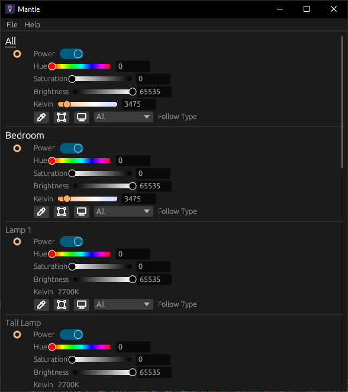

# Mantle

Mantle is a desktop application for controlling LIFX lights, born from the ashes of [`lifx_control_panel`](https://github.com/samclane/LIFX-Control-Panel).

## Releases

You can download the latest release [here](https://github.com/samclane/mantle/releases).

**Note:** Right now I'm only building for Windows, but it should build on Linux and MacOS as well. Still getting GitHub Actions set up for that.

## Screenshots

## Features

- Monitor LIFX light status
- Control LIFX lights
- Control multiple lights
  - Group lights
  - Control all lights
- Eyedropper tool
- Real Time Screen averaging for ambient lighting

## Building

Simply run `cargo build --release` to build the project. Ensure you have the `data` folder, containing `products.json`.

## Feature Flags

- `puffin` - Enables the Puffin profiler

## Feedback

Join the Discord server [here](https://discord.gg/TwqSeTTYqX) to provide feedback, report bugs, or request features.

## Acknowledgements

- [`lifx_control_panel`](https://github.com/samclane/LIFX-Control-Panel)
- [`lifx-core`](https://github.com/eminence/lifx)
- [`lifxlan (Python)`](https://github.com/mclarkk/lifxlan)
- [`eframe_template`](https://github.com/emilk/eframe_template)
